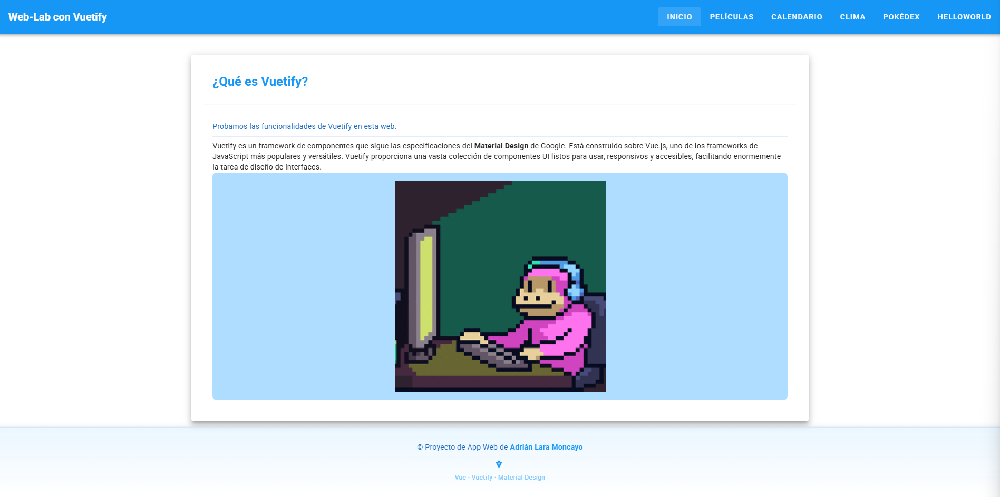
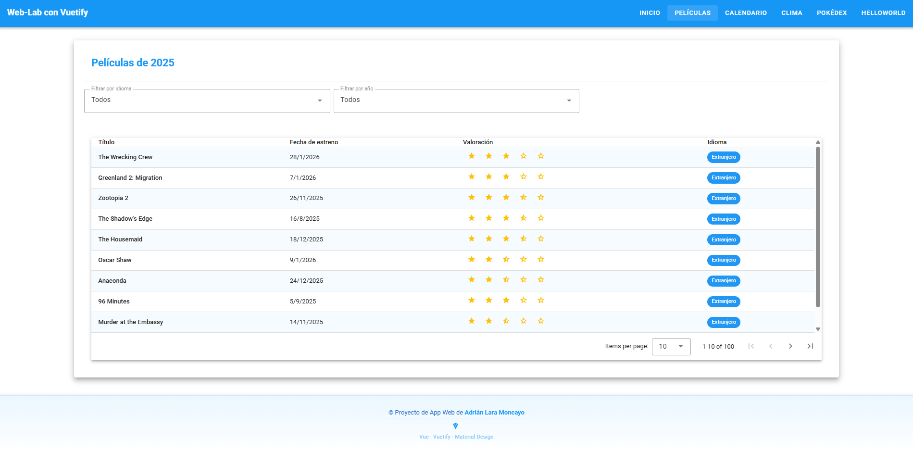
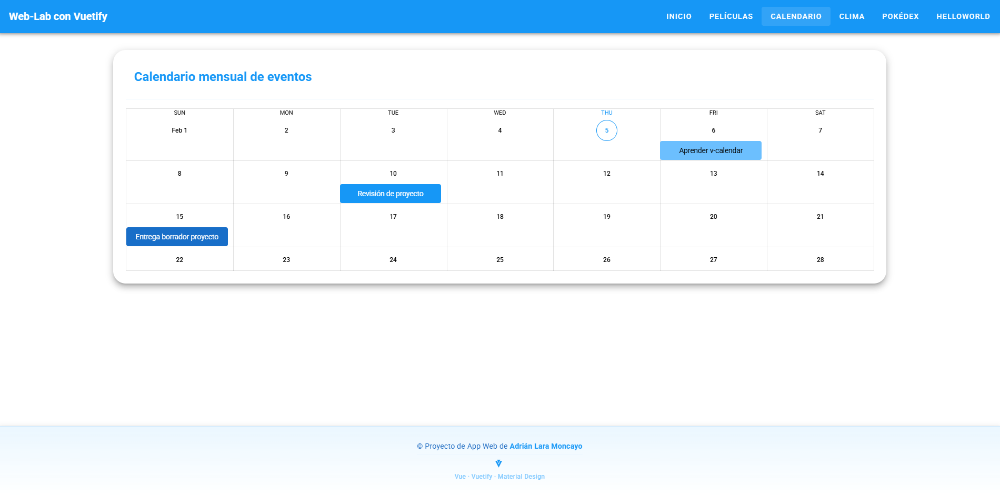
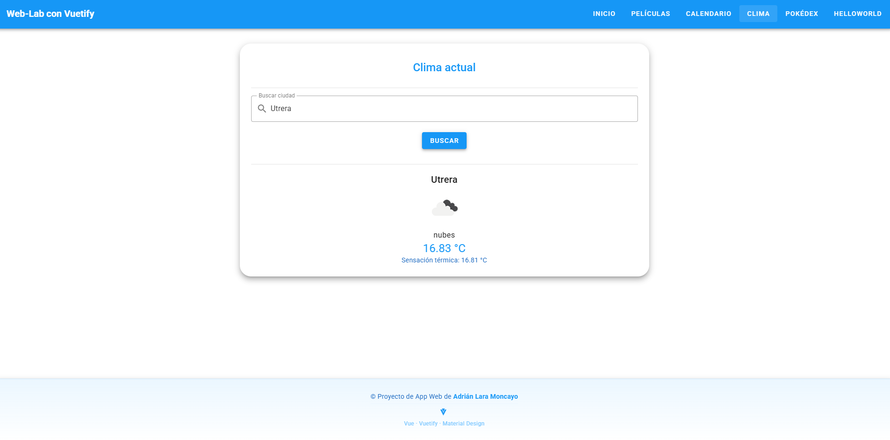
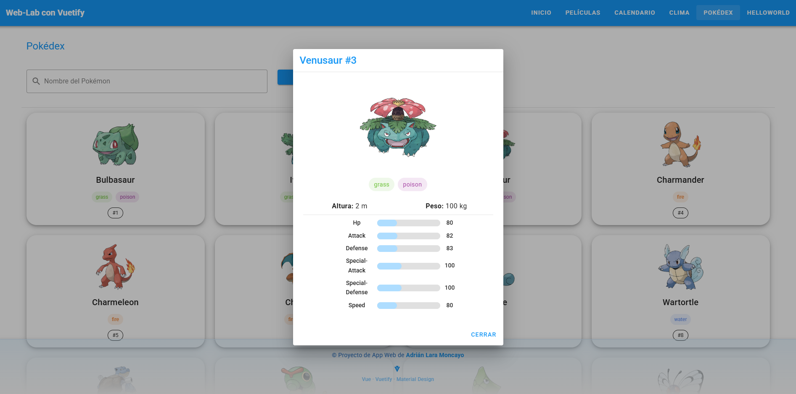

# App Web Interactiva con Vue.js y Vuetify

**proyectVuetify** es una aplicación web interactiva creada con **Vue 3** y **Vuetify 3**, diseñada para demostrar funcionalidades avanzadas de UI/UX y consumo de APIs externas de forma dinámica y responsiva.

---

## 🌟 Características principales

- **Home**: Introducción al proyecto y explicación de Vuetify.
- **DataTable**: Tabla de películas con filtros por idioma y año, paginación responsiva y visualización de ratings y países.
- **Calendar**: Calendario interactivo con eventos; al hacer click en un evento se muestra un dialog con detalles.
- **Clima**: Consulta del clima por ciudad o geolocalización, con resultados en tiempo real.
- **Pokémon**: Integración con la [PokéAPI](https://pokeapi.co/); al seleccionar un Pokémon se abre un dialog con imagen centrada, stats visuales y colores por tipo.
- **Responsive UI**: Navbar y footer adaptados a móviles y desktop; componentes ajustados con Flexbox y diseño limpio.

---

## 🎨 Tecnologías utilizadas

- [Vue 3](https://vuejs.org/)
- [Vuetify 3](https://vuetifyjs.com/)
- Material Design
- APIs externas: Clima, Pokémon
- HTML5, CSS3, JavaScript

---

## 📷 Capturas de pantalla

- **Home**:
  
- **DataTable**:
  
- **Calendar**:
  
- **Weather**:

- **Pokémon dialog**:
  


---

## 🚀 Instalación y ejecución

1. Clonar el repositorio:
```bash
git clone <URL_DEL_REPO>
```

2. Instalar dependencias:
```bash
npm install
```

3. Ejecutar la aplicación:
```bash
npm run dev
```

4. Abrir en el navegador:
```
http://localhost:5173/
```

---

## 📌 Mejoras y próximos pasos

- Incluir componentes adicionales de Vuetify.
- Mejorar experiencia visual y UX de los diálogos y tablas.
- Integración con más APIs externas.

---


### ⚡ Notas finales

Este proyecto está pensado como **portfolio personal**, demostrando la integración de Vuetify con Vue 3, consumo de APIs externas y buenas prácticas de diseño responsive y moderno.